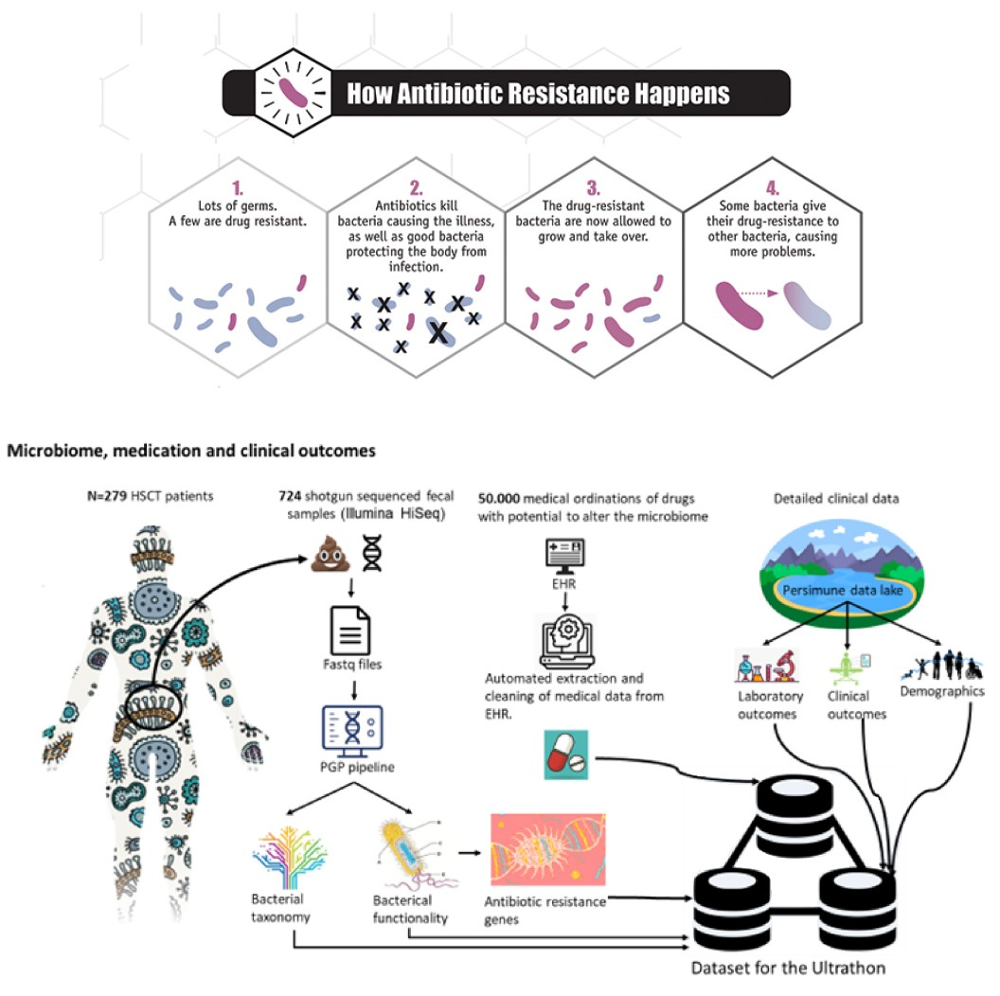

<p align="center"></p>

This repository contains the MAIDS description for project U21-01. It was built by cloning the [MAIDS-Template](https://github.com/PERSIMUNE/MAIDS-Template). You will find more details about this dataset below with links to visit the website and download the PDF.

>MAIDS is currently being prototyped for the [Copenhagen Ultrathon on Precision Medicine](https://ultrathon.online) where you will find more information about the event. You may also be interested in viewing other examples listed in the 2021 Ultrathon [Project Pool](https://github.com/UltrathonOnline/U21-PROJECT-POOL).

There are several ways to stay informed:
* Visit the Ultrathon's [landing page](https://ultrathon.online) and sign up to the mailing list.
* Follow us on [Twitter](https://twitter.com/UltrathonOnline).
* Watch the repository for changes.

---

### **&#10149; U21-07**
#### **Microbiome, medication and clinical outcomes**
<p align="center"></p>

>Visit the [website](https://ultrathononline.github.io/MAIDS.U21-07.ARG/) for this dataset or download the formatted [PDF](./docs/maids.pdf).
```
Henrik Sengeløv, Jens Christian Nørgaard
@: Rigshospitalet, Copenhagen, Denmark

Based on one of the world's largest patient cohorts with metagenomic sequenced fecal samples we wanted to
describe the interplay between previous treatment with antibiotics and presence of antibiotic resistance genes
(ARGs). In order to do this, we have established a bioinformatic pipeline to map antibiotic resistance genes 
and we have established an automatic way of extracting data on use of antibiotics (anti-bacteria, -virus,
-fungi), immunosuppressants and chemotherapy. Moreover, we have detailed data on demographics, clinical
outcomes and other microbiome features such as taxonomy.
```